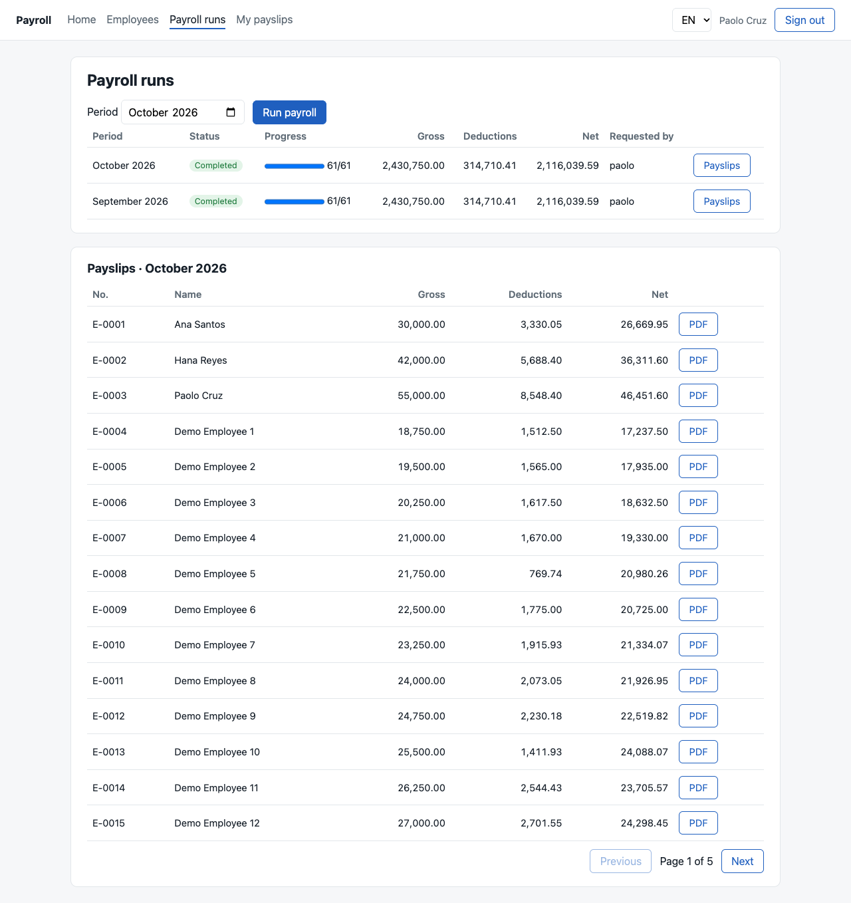

# App 1: HR & Payroll Platform

Companion project: [proxy-voting-tracker](https://github.com/nearbyjustine/proxy-voting-tracker) · Both share the [concepts handbook](docs/handbook/README.md).

Spring Boot 4.1 · Java 21 · PostgreSQL + Flyway · Keycloak (OIDC) · S3 on LocalStack · Vue 3 + TypeScript

HR maintains employees, payroll admins run monthly payroll (processed asynchronously in chunks, with pluggable
deduction rules), and employees download their own payslip PDFs through short-lived pre-signed S3 links.
Plan: [docs/PLAN.md](docs/PLAN.md) · Concepts: [docs/handbook](docs/handbook/README.md)



## Run it

```bash
# 1) infrastructure: Postgres :5432, Keycloak :8180, LocalStack (S3) :4566
docker compose up -d

# 2a) API + web from source (hot reload)
cd backend && ./mvnw spring-boot:run          # http://localhost:8080
cd frontend && npm install && npm run dev     # http://localhost:5173

# 2b) ...or everything in containers
cd backend && ./mvnw -DskipTests package && cd ..
docker compose --profile full up -d --build   # web on http://localhost:8081
```

| User | Password | Roles | Can do |
|---|---|---|---|
| ana | ana123 | EMPLOYEE | view/download own payslips |
| hana | hana123 | HR, EMPLOYEE | manage employees |
| paolo | paolo123 | PAYROLL_ADMIN, EMPLOYEE | run payroll, see all payslips |

Keycloak admin console: http://localhost:8180 (admin / admin).

## Test it

```bash
cd backend && ./mvnw test        # 36 tests: unit, Mockito, @WebMvcTest+JWT, @DataJpaTest and full flow on Testcontainers
cd frontend && npm test          # Vitest
cd e2e && npm install && npm test   # real browser logins through Keycloak (needs the full stack + Chrome)
```

## Highlights (where to look)

| Concept | Code |
|---|---|
| Strategy pattern for deductions, ordered with `@Order` | `backend/.../payroll/rules/` |
| 202 Accepted + async chunked processing, idempotent | `PayrollRunService`, `PayrollProcessor` |
| After-commit domain event | `PayrollRunRequested` + `@TransactionalEventListener` |
| Object-level authorization (no IDOR) | `PayslipService.downloadUrl` |
| Pre-signed S3 URLs, LocalStack vs real AWS | `AwsConfig`, `S3PayslipStorage` |
| ProblemDetail errors in EN/FIL with correlation IDs | `common/ApiExceptionHandler`, `CorrelationIdFilter` |
| Optimistic locking → 409 | `Employee.version`, `EmployeeService.update` |
| OIDC + PKCE in the SPA | `frontend/src/stores/auth.ts` |

Deduction rates are simplified for learning, not legal or payroll advice.
